# FIGURES {#sec:figures}

(ref:fig1-caption) Location of the four AZMP fixed stations in the Gully MPA (blue circles). The boundaries of the three Gully Management Zones are also shown. Top-right map inset shows the position of the Gully MPA in relation to Atlantic Canada and DFO’s Maritime Region administrative boundary.

\vspace*{\fill}

```{r figure1, fig.align = "center", fig.cap = "(ref:fig1-caption)"}

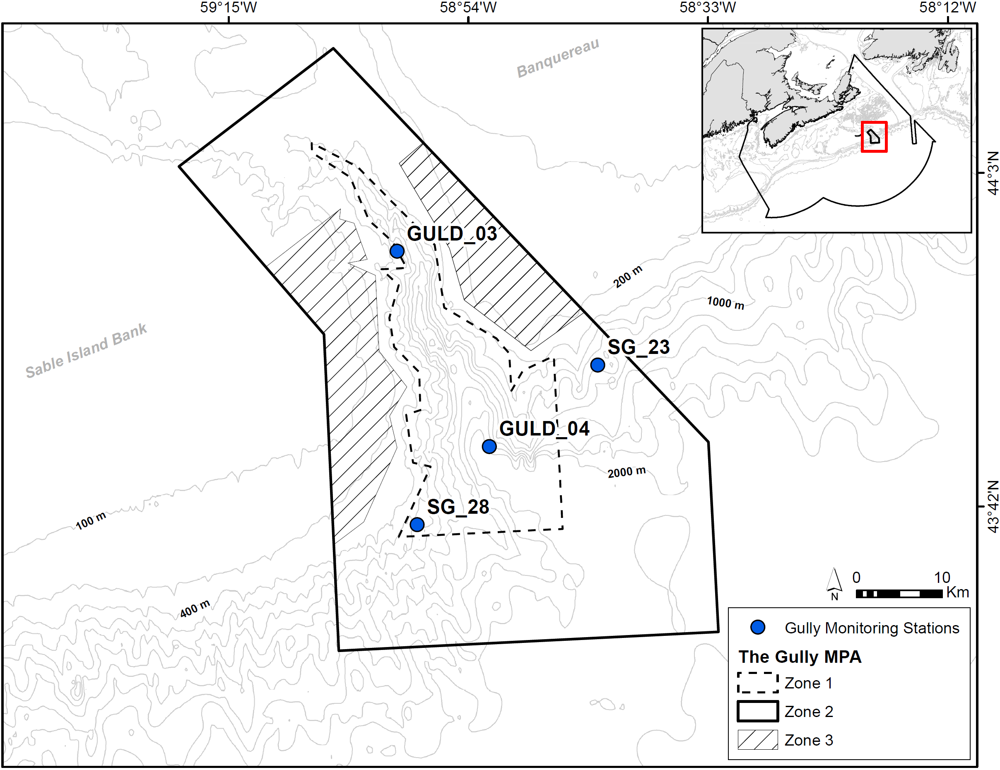

```
\vspace*{\fill}

\clearpage


(ref:fig2-caption) Location of the four AZMP fixed monitoring stations in the Gully MPA in relation to canyon topography as highlighted by 15-m resolution multibeam bathymetry. The nominal location of each station is represented by the blue circles, while all occupations where CTD data were collected and considered in this report are represented by fuchsia circles.

```{r figure2, fig.align = "center", fig.cap = "(ref:fig2-caption)"}

knitr::include_graphics('figure/Figure02.png')

```
\clearpage


(ref:fig3-caption) The Gully MPA in relation to comparative upstream (LL_07) and downstream (HL_06) stations from the AZMP’s core Louisbourg and Halifax lines, respectively.

```{r figure3, fig.align = "center", fig.cap = "(ref:fig3-caption)"}

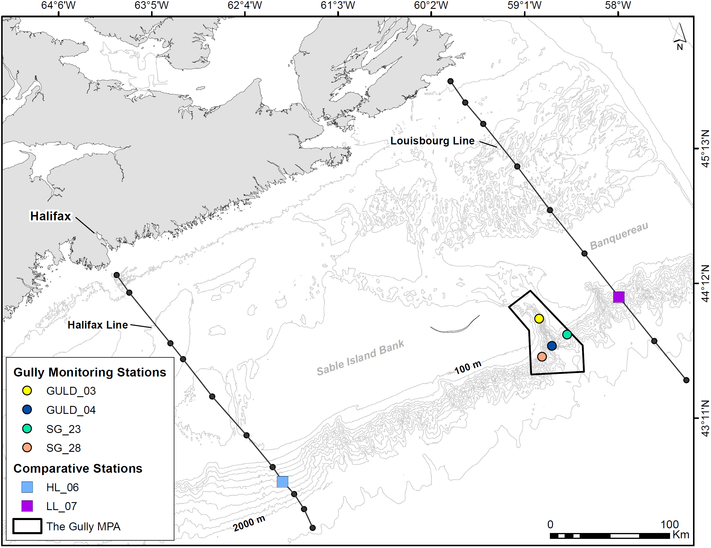

```
\clearpage


(ref:fig4-caption) Areas of the slope waters upstream (Slope Water LL) and downstream (Slope Water HL) of the Gully MPA for which bi-weekly satellite measurements of Sea Surface Temperature (SST) and Sea Surface Chlorophyll (SSC) were calculated between 1998 and 2018.

```{r figure4, fig.align = "center", fig.cap = "(ref:fig4-caption)"}

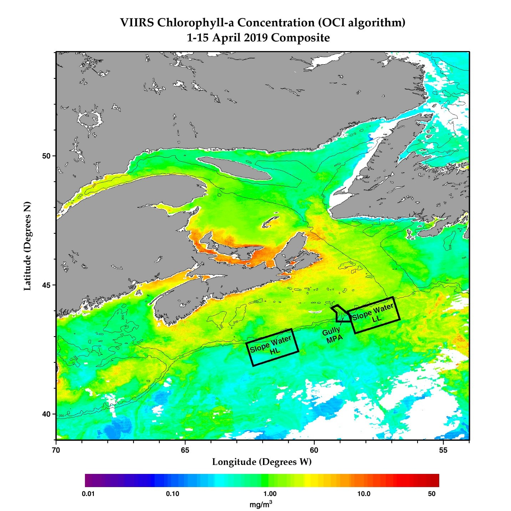

```
\clearpage

<!-- Start Landscape here  -->

(ref:fig5-caption) Mean (black line) temperature (\($\degree$C\)) $\pm$ 95% confidence interval (red dash) calculated across individual CTD profiles (grey lines) collected at each of the four AZMP fixed stations in the Gully during the spring (top panel: April) and fall (bottom panel: September and October). Mean conditions at each station were computed by averaging the values in each 1 m depth bin across casts collected within each season.

\begin{landscapepage}

```{r figure5, fig.align = "center", fig.cap = "(ref:fig5-caption)", out.width = "7.5in"}

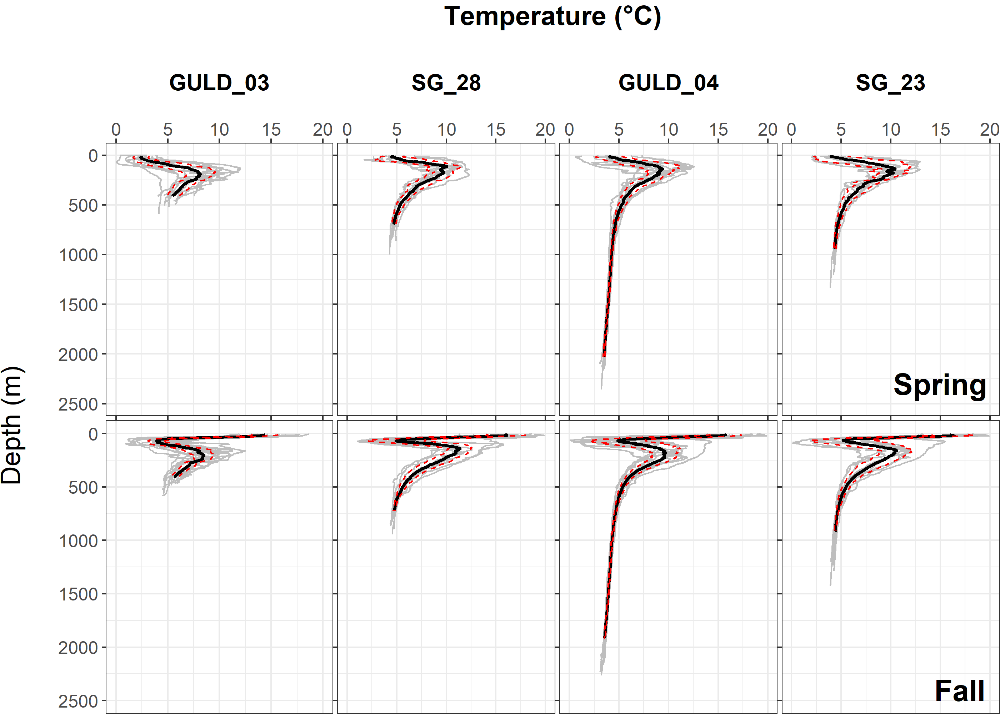

```

\end{landscapepage}
\clearpage


(ref:fig6-caption) Mean (black line) salinity $\pm$ 95% confidence interval (red dash) calculated across individual CTD profiles (grey lines) collected at each of the four AZMP fixed stations in the Gully during the spring (April; top panel) and fall (September and October; bottom panel). Mean conditions at each station were computed by averaging the values in each 1 depth bin across casts collected within each season.

\begin{landscapepage}

```{r figure6, fig.align = "center", fig.cap = "(ref:fig6-caption)", out.width = "7.5in"}

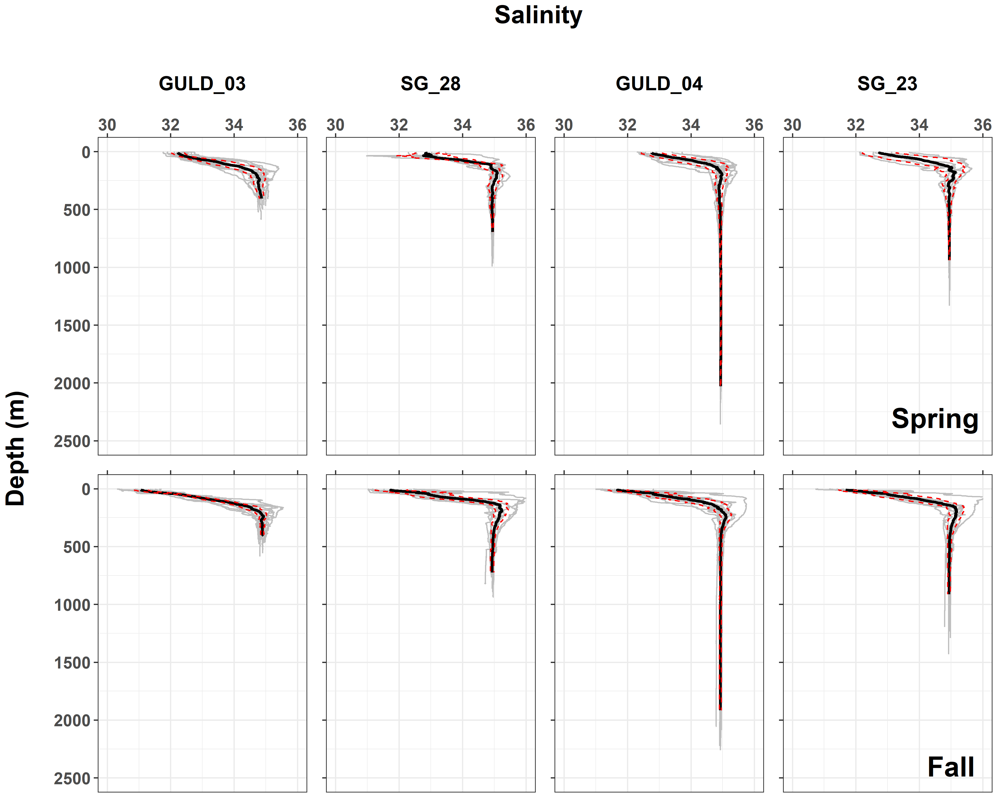

```

\end{landscapepage}
\clearpage


(ref:fig7-caption) Mean (black line) oxygen (ml L\textsuperscript{-1}) $\pm$ 95% confidence interval (red dash) calculated across individual CTD profiles (grey lines) collected at each of the four AZMP fixed stations in the Gully during the spring (April; top panel) and fall (September-October; bottom panel). Mean conditions at each station were computed by averaging the values in each 1 depth bin across casts collected within each season. Oxygen data presented for each station is from 2013 onward.

\begin{landscapepage}

```{r figure7, fig.align = "center", fig.cap = "(ref:fig7-caption)", out.width = "7.5in"}

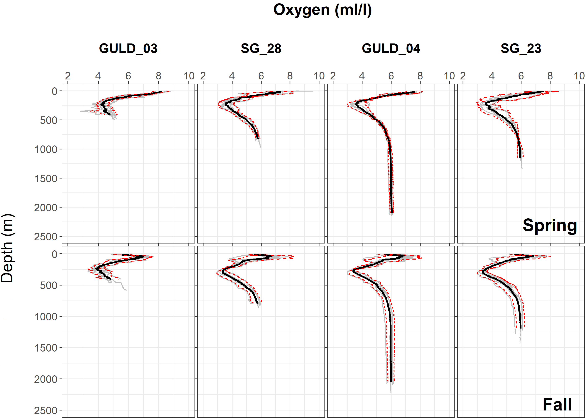

```
\end{landscapepage}
\clearpage


(ref:fig8-caption) Comparison of the vertically-averaged temperature (\($\degree$C\)), salinity, and dissolved oxygen (ml L\textsuperscript{-1}) profiles at each of the four AZMP fixed stations in the Gully during spring (April) and fall (September and October). Data were collected between 2000 to 2018 for GULD_03 and GULD_04, and 2007 to 2018 for SG_23 and SG_28 (with slight variations between seasons). Oxygen data presented for each station is from 2013 onward.

\begin{landscapepage}

```{r figure8, fig.align = "center", fig.cap = "(ref:fig8-caption)", out.width = "9.25in"}

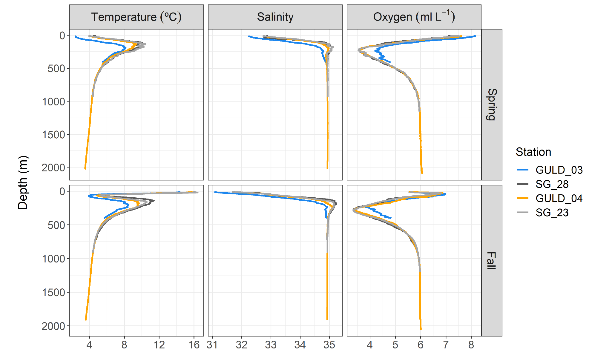

```

\end{landscapepage}
\clearpage


(ref:fig9-caption) Temperature-Salinity (T-S) plots of CTD profile data collected at each of the four AZMP fixed stations in the Gully in during the spring (April; top panel) and fall (September and October; bottom panel). Data were collected between 2000 to 2018 for GULD_03 and GULD_04, and 2007 to 2018 for SG_23 and SG_28 (with slight variations between seasons).

\begin{landscapepage}

```{r figure9, fig.align = "center", fig.cap = "(ref:fig9-caption)", out.width = "9.0in"}

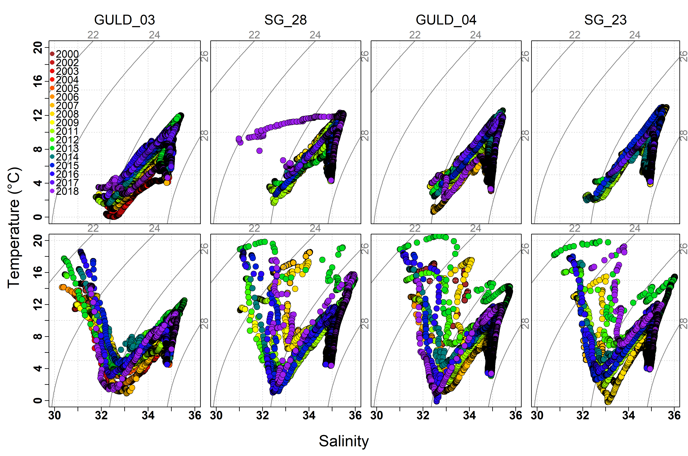

```

\end{landscapepage}
\clearpage

<!-- End Landscape here  -->


(ref:fig10-caption) Changes in mean spring and fall temperature (\($\degree$C\)) in five vertical depth intervals sampled at each of the four AZMP fixed stations in the Gully. Circles represent mean temperature at each depth interval and year. Absent circles indicate that sampling did not occur at that station in that year. Date range of data collection varies between stations and is summarized in Table \@ref(tab:table2). Note that the 400 to 750 m depth interval for GULD_03 spans from >400 to near-bottom (up to 586 m).

```{r figure10, fig.align = "center", fig.cap = "(ref:fig10-caption)"}

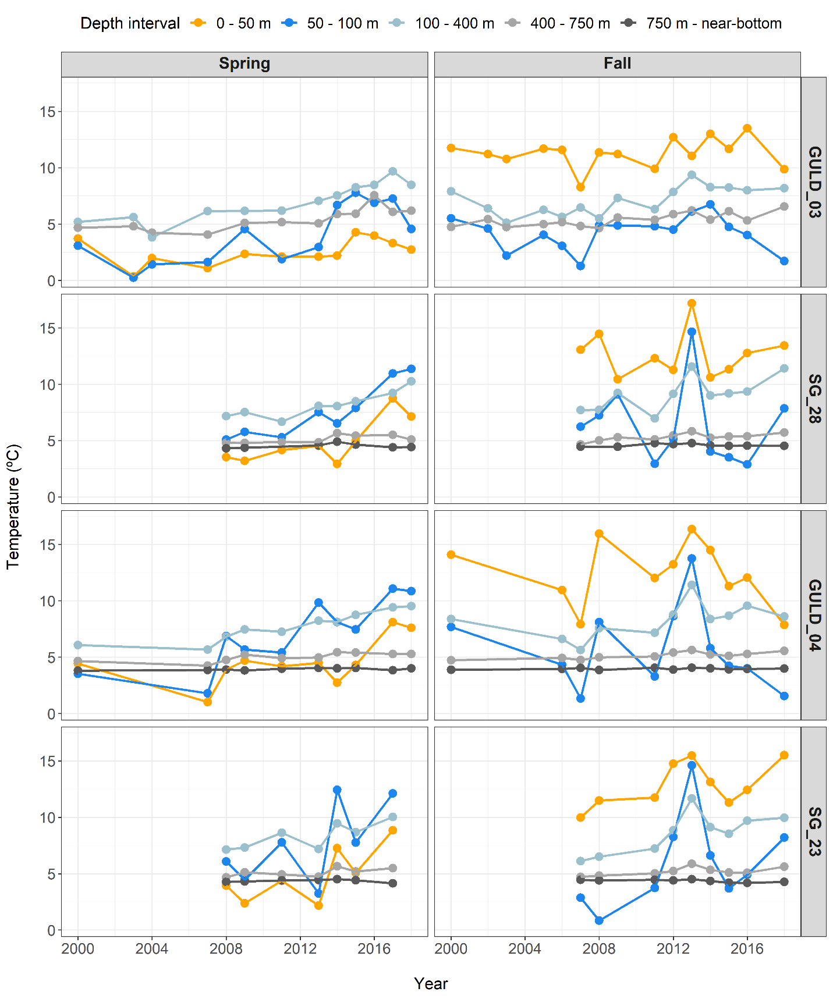

```

\clearpage


(ref:fig11-caption) Changes in mean spring and fall salinity in five vertical depth intervals sampled at each of the four AZMP fixed stations in the Gully. Circles represent mean salinity at each depth interval and year. Absent circles indicate that sampling did not occur at that station in that year. Date range of data collection varies between stations and is summarized in Table \@ref(tab:table2). Note that the 400 to 750 m depth interval for GULD_03 spans from >400 to near-bottom (up to 586 m).

```{r figure11, fig.align = "center", fig.cap = "(ref:fig11-caption)"}

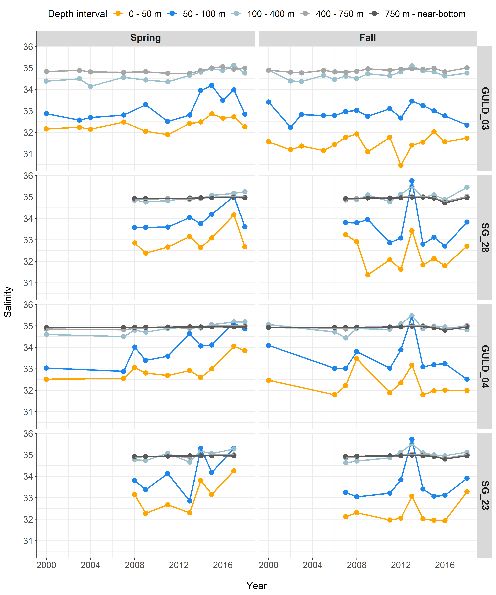

```

\clearpage


(ref:fig12-caption) Changes in mean spring and fall dissolved oxygen concentration (ml L\textsuperscript{-1}) in five vertical depth intervals sampled at each of the four AZMP fixed stations in the Gully from 2013 to 2018. Only calibrated data from 2013 onward are included. Circles represent mean oxygen at each depth interval and year. Absent circles indicate that sampling did not occur at that station in that year. Note that the 400 to 750 m depth interval for GULD_03 spans from >400 to near-bottom (up to 586 m). Oxygen data were not available for the surface layer (0 to 50 m) at GULD_03 in 2013.

```{r figure12, fig.align = "center", fig.cap = "(ref:fig12-caption)"}

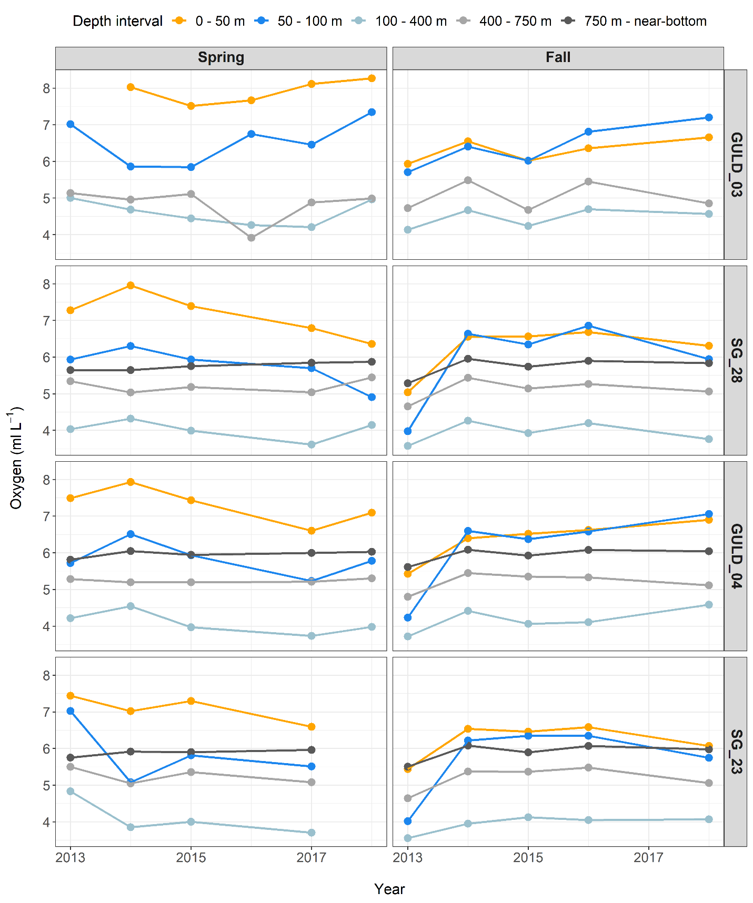

```

\clearpage

<!-- Begin Landscape here  -->

(ref:fig13-caption) Comparison average temperature (\($\degree$C\)), salinity, and dissolved oxygen (ml L\textsuperscript{-1}) to 1000 m on the four AZMP fixed stations in the Gully, and stations upstream (LL_07) and downstream (HL_06) of the Gully. Data were collected in the spring (April) and fall (September and October) between 2000 to 2018 for GULD_03, GULD_04, HL_06, and LL_07, and 2007 to 2018 for SG_23 and SG_28 (with slight variations between seasons). Oxygen data presented for each station is from 2013 onward.

\begin{landscapepage}

```{r figure13, fig.align = "center", fig.cap = "(ref:fig13-caption)", out.width = "9.5in"}

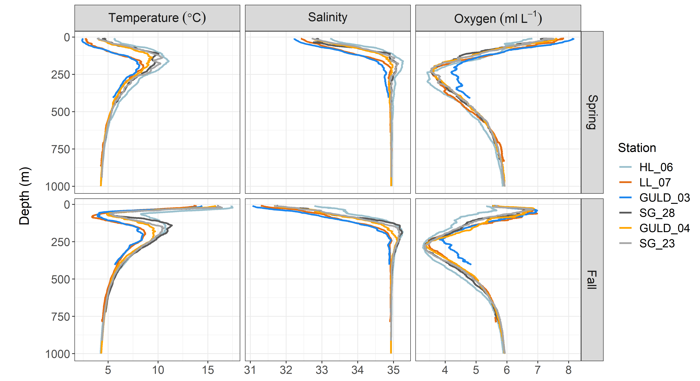

```

\end{landscapepage}
\clearpage

<!-- End Landscape here  -->


(ref:fig14-caption) Remotely-sensed bi-monthly average sea surface temperatures (1998 to 2018, mean $\pm$ S.D.) in the slope water satellite areas off the eastern (SW  LL) and central (SW HL) Scotian Shelf and in the Gully MPA (GMPA).

```{r figure14, fig.align = "center", fig.cap = "(ref:fig14-caption)"}

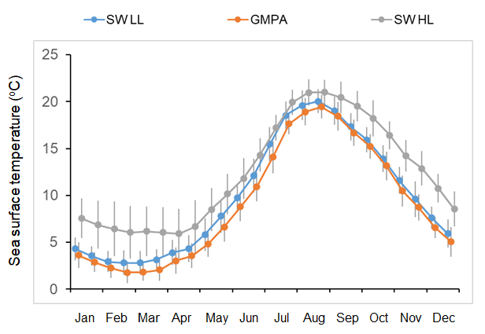

```

\clearpage


(ref:fig15-caption) Time series for remotely-sensed annual, spring and fall average sea surface temperatures in slope water satellite areas off the eastern (SW LL) and central (SW HL) Scotian Shelf and in the Gully MPA (GMPA).  Lines and equations are shown for significant trends.

```{r figure15, fig.align = "center", fig.cap = "(ref:fig15-caption)", out.width = "5.0in"}

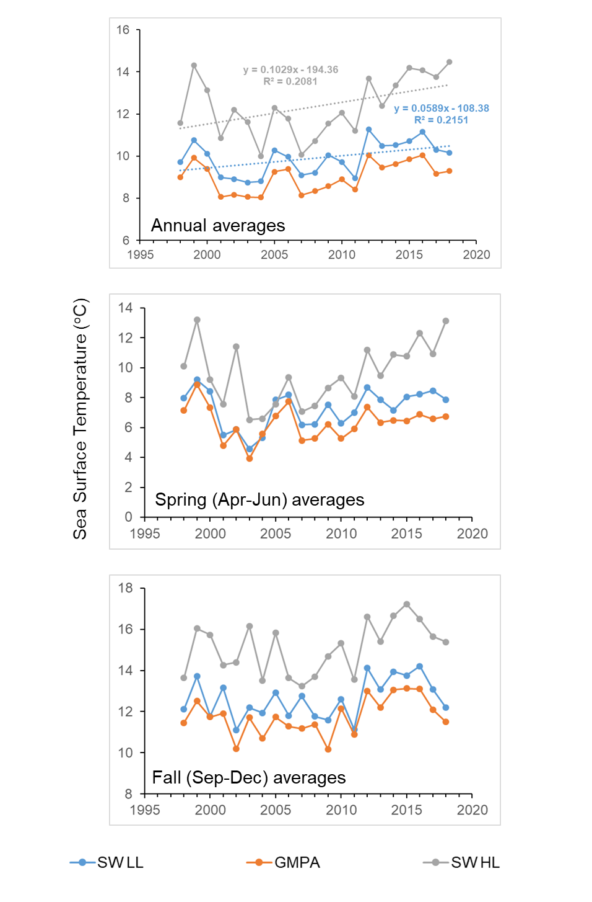

```

\clearpage


(ref:fig16-caption) Relationships between _in situ_ 5 m temperatures measured at HL_06, GULD_03 and LL_07 during AZMP and other sampling missions and remotely-sensed sea surface temperatures averaged for the corresponding months/years for the SW HL, GMPA and SW LL satellite areas. Filled circles, squares and triangles represent measurements in April, May and June, respectively, in spring, and in September, October and December, respectively, in fall. 

```{r figure16, fig.align = "center", fig.cap = "(ref:fig16-caption)"}

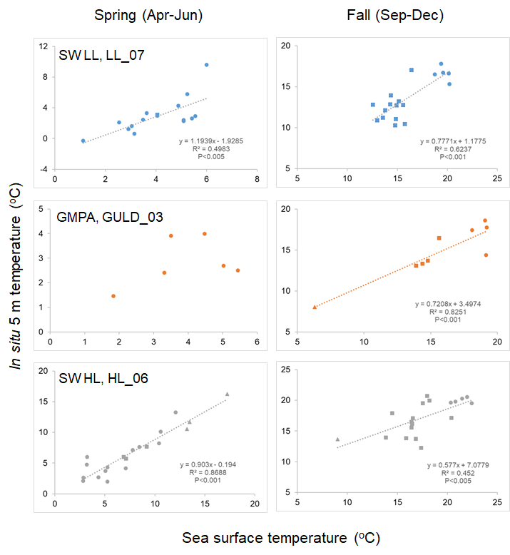

```

\clearpage


<!-- Begin Landscape here  -->

(ref:fig17-caption) Mean vertical structure in spring and fall nitrate, phosphate, and silicate concentration ($\mu$M) at the four AZMP fixed stations in the Gully. Mean values were calculated at each standard nominal depth (see Table \@ref(tab:table3)) and connected with trend lines. Near-bottom sample depth varied between years and seasons and was represented by the average depth of the near-bottom bottle collected across all years (see Methods section).

\begin{landscapepage}

```{r figure17, fig.align = "center", fig.cap = "(ref:fig17-caption)", out.width = "7.5in"}

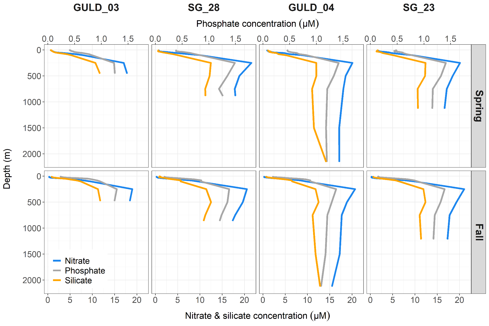

```

\end{landscapepage}
\clearpage

<!-- End Landscape here  -->


(ref:fig18-caption) Vertically-integrated nitrate, phosphate, and silicate concentration (mmol m\textsuperscript{-3}) sampled in the spring (April) and fall (September and October) at AZMP fixed station GULD_03. Circles represent the vertically-integrated nutrient inventories for each depth interval and year. Absent circles indicate that sampling did not occur within that particular depth interval and/or year.

```{r figure18, fig.align = "center", fig.cap = "(ref:fig18-caption)"}

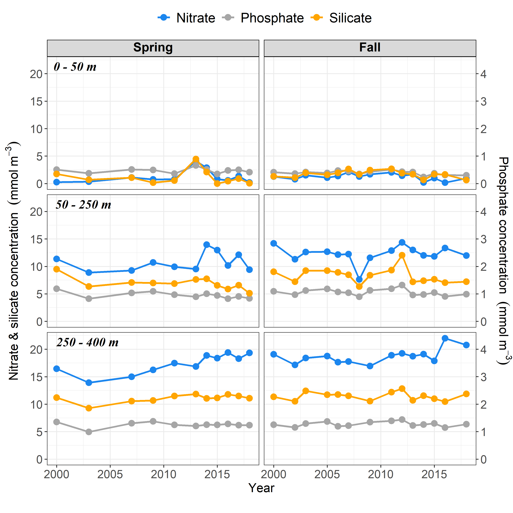

```

\clearpage


(ref:fig19-caption) Vertically-integrated nitrate, phosphate, and silicate concentration (mmol m\textsuperscript{-3}) sampled in the spring (April) and fall (September and October) at AZMP fixed station SG_28. Circles represent the vertically-integrated nutrient inventories for each depth interval and year. Absent circles indicate that sampling did not occur within that particular depth interval and/or year.

```{r figure19, fig.align = "center", fig.cap = "(ref:fig19-caption)"}

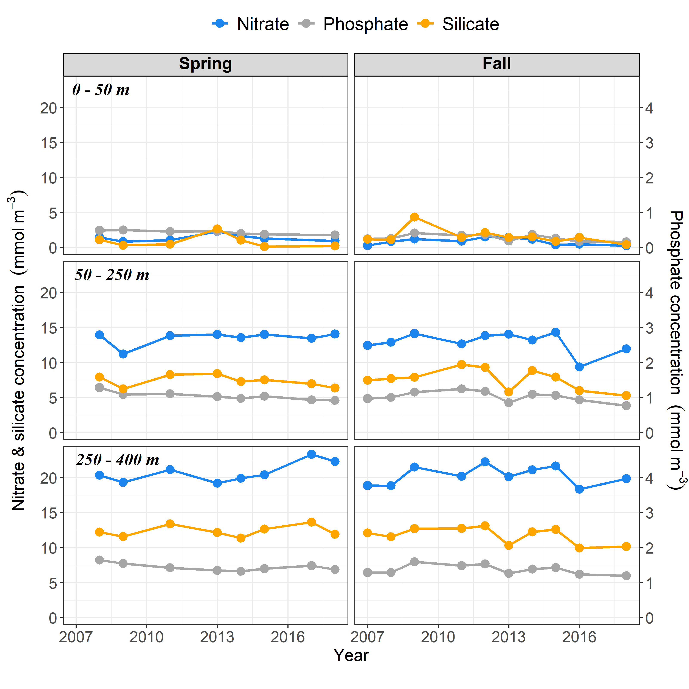

```

\clearpage


(ref:fig20-caption) Vertically-integrated nitrate, phosphate, and silicate concentration (mmol m\textsuperscript{-3}) sampled in the spring (April) and fall (September and October) at AZMP fixed station GULD_04. Circles represent the vertically-integrated nutrient inventories for each depth interval and year. Absent circles indicate that sampling did not occur within that particular depth interval and/or year.

```{r figure20, fig.align = "center", fig.cap = "(ref:fig20-caption)"}

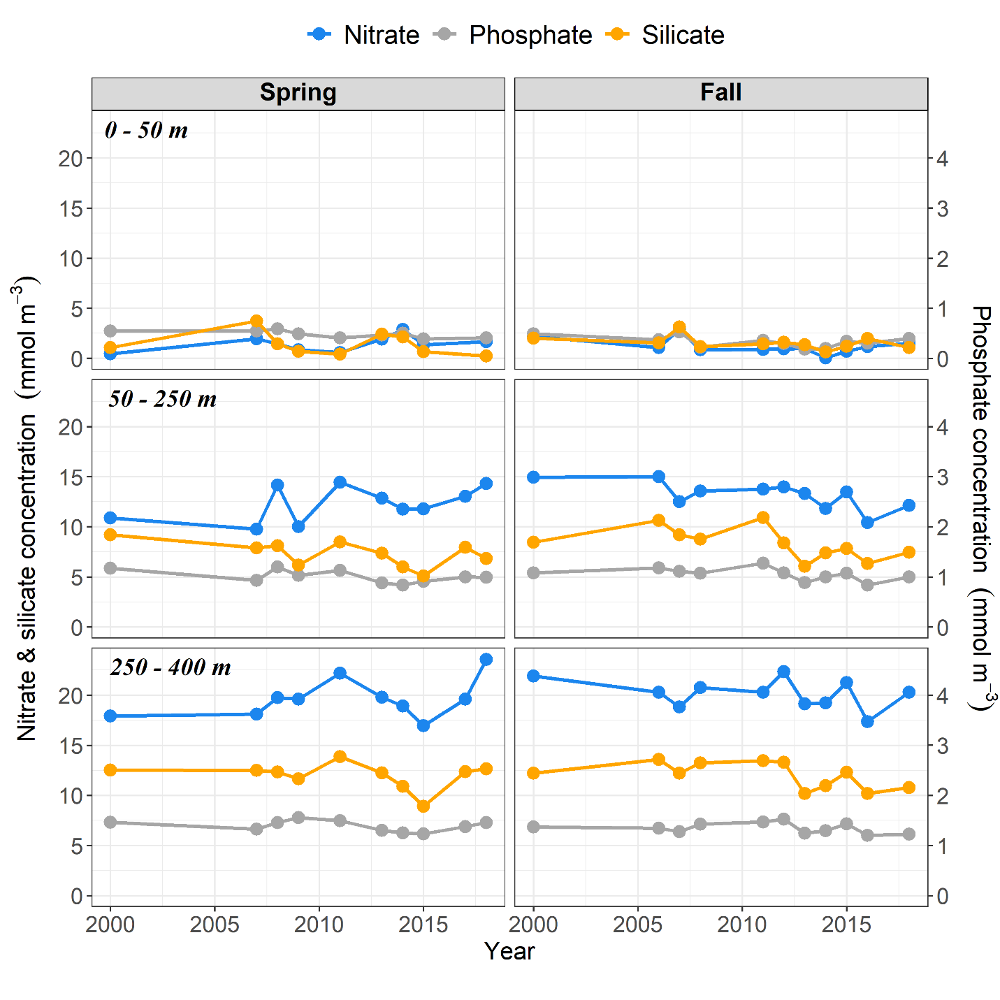

```

\clearpage


(ref:fig21-caption) Vertically-integrated nitrate, phosphate, and silicate concentration (mmol m\textsuperscript{-3}) sampled in the spring (April) and fall (September and October) at AZMP fixed station SG_23. Circles represent the vertically-integrated nutrient inventories for each depth interval and year. Absent circles indicate that sampling did not occur within that particular depth interval and/or year.

```{r figure21, fig.align = "center", fig.cap = "(ref:fig21-caption)"}

knitr::include_graphics('figure/Figure21.png')

```

\clearpage

<!-- Begin Landscape here  -->

(ref:fig22-caption) Mean nitrate, phosphate, and silicate concentration (mmol m\textsuperscript{-3}) in spring (blue circles) and fall (orange circles) at each of the four AZMP fixed stations in the Gully MPA, and stations upstream (LL_07) and downstream (HL_06) of the Gully. Error bars are $\pm$ standard deviation. Data were collected in the spring (April) and fall (September and October) between 2000 to 2018 for GULD_03, GULD_04, HL_06, and LL_07, and 2007 to 2018 for SG_23 and SG_28 (with slight variations between seasons). 

\begin{landscapepage}

```{r figure22, fig.align = "center", fig.cap = "(ref:fig22-caption)", out.width = "6.5in"}

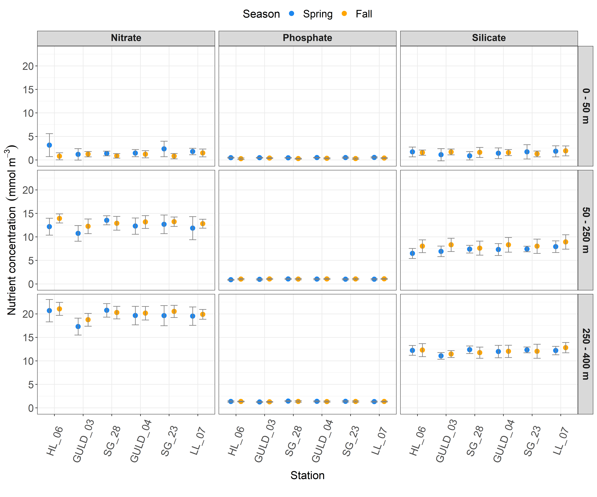

```

\end{landscapepage}
\clearpage


(ref:fig23-caption) Mean vertical structure in spring and fall chlorophyll _a_ concentration ($\mu$g L\textsuperscript{-1}) from the surface to 100 m depth at the four AZMP fixed stations in the Gully. Circles represent mean chlorophyll a concentration calculated at each standard nominal depth (see Table \@ref(tab:table3)) of samples. Error bars are $\pm$ standard deviation.

\begin{landscapepage}

```{r figure23, fig.align = "center", fig.cap = "(ref:fig23-caption)", out.width = "7.5in"}

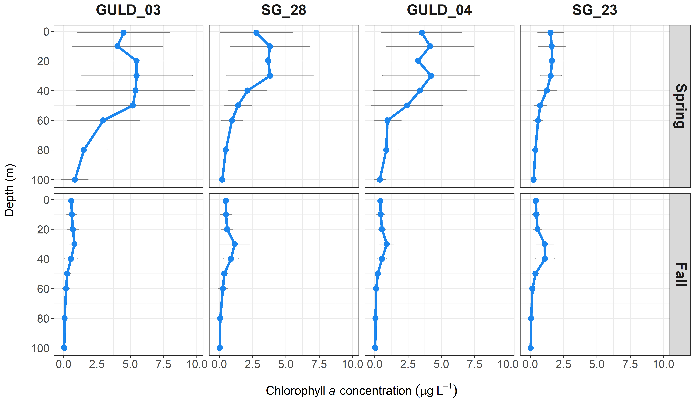

```

\end{landscapepage}
\clearpage

<!-- End Landscape here  -->


(ref:fig24-caption) Vertically-integrated chlorophyll _a_ concentration (mg m\textsuperscript{-3}) from the top 100 m sampled in the spring (April) and fall (September and October) at the four AZMP fixed stations in the Gully. Absent circles indicate that sampling did not occur within that particular depth interval and/or year.

```{r figure24, fig.align = "center", fig.cap = "(ref:fig24-caption)"}

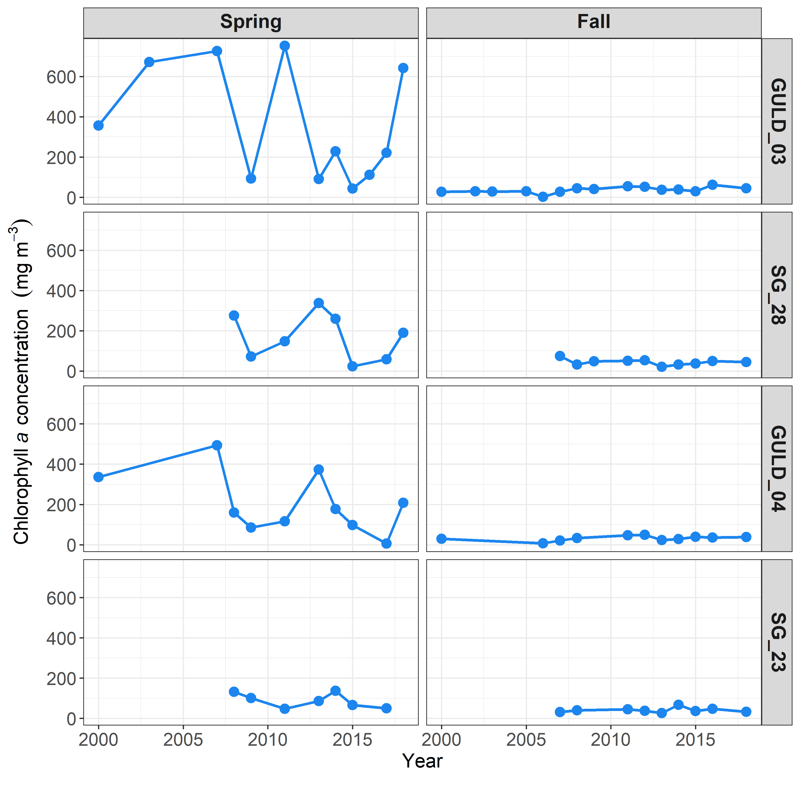

```

\clearpage


(ref:fig25-caption) Remotely-sensed bi-monthly average sea surface chlorophyll concentrations (1998 to 2018, $\pm$ S.D.) in the slope water satellite areas off the eastern (SW LL) and central (SW HL) Scotian Shelf and in the Gully MPA (GMPA).

```{r figure25, fig.align = "center", fig.cap = "(ref:fig25-caption)"}

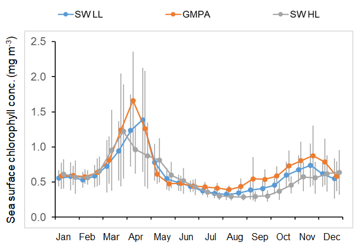

```

\clearpage


(ref:fig26-caption) Time series for remotely-sensed annual average sea surface chlorophyll concentrations between 1998 and 2018 in the slope water satellite areas off the eastern (SW LL) and central (SW HL) Scotian Shelf and in the Gully MPA (GMPA).

```{r figure26, fig.align = "center", fig.cap = "(ref:fig26-caption)"}

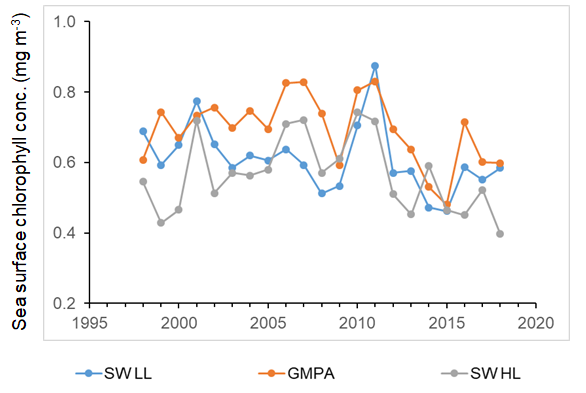

```

\clearpage


(ref:fig27-caption) Average values (1998 to 2018, $\pm$ S.D.) of the spring bloom metrics derived from the time shifted Gaussian functions fitted to the spring peaks of sea surface chlorophyll concentration in the slope water areas off the central (SW HL) and eastern (SW LL) Scotian Shelf and the Gully MPA (GMPA). Filled circles, squares, triangles and diamonds represent values for bloom start dates, durations, magnitudes and amplitudes, respectively.

```{r figure27, fig.align = "center", fig.cap = "(ref:fig27-caption)"}

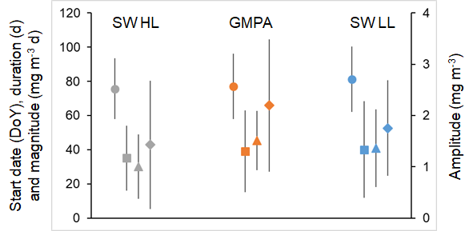

```

\clearpage


(ref:fig28-caption) Relationships between _in situ_ measurements of chlorophyll concentrations in the 0 to 10 m depth range at stations throughout the satellite areas (SW LL, GMPA, SW HL) and remotely-sensed sea surface chlorophyll concentrations averaged for the appropriate months/years.

```{r figure28, fig.align = "center", fig.cap = "(ref:fig28-caption)"}

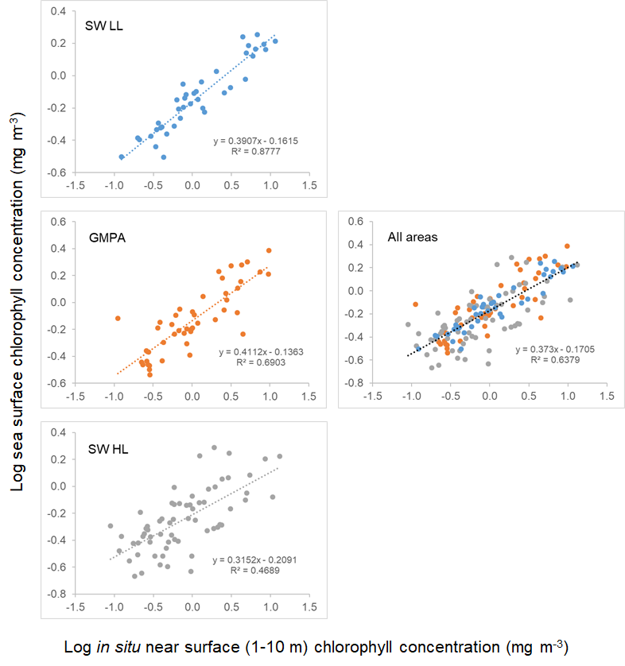

```

\clearpage


(ref:fig29-caption) Time series for bulk wet weight biomass of large (>1 cm, filled circles) and small (<1 cm, open squares) zooplankton in spring at stations upstream (LL_07) and downstream (HL_06) of the Gully, within the Gully (GULD_03) and across the Gully mouth (SG_28, GULD_04, SG_23).

```{r figure29, fig.align = "center", fig.cap = "(ref:fig29-caption)"}

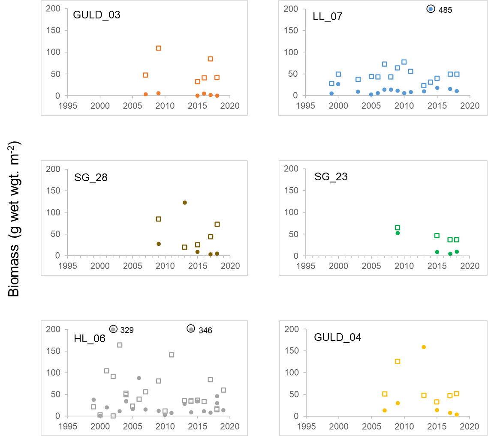

```

\clearpage


(ref:fig30-caption) Time series for bulk wet weight biomass of large (>1 cm, filled circles) and small (<1 cm, open squares) zooplankton in fall at stations upstream (LL_07) and downstream (HL_06) of the Gully, within the Gully (GULD_03) and across the Gully mouth (SG_28, GULD_04, SG_23).

```{r figure30, fig.align = "center", fig.cap = "(ref:fig30-caption)"}

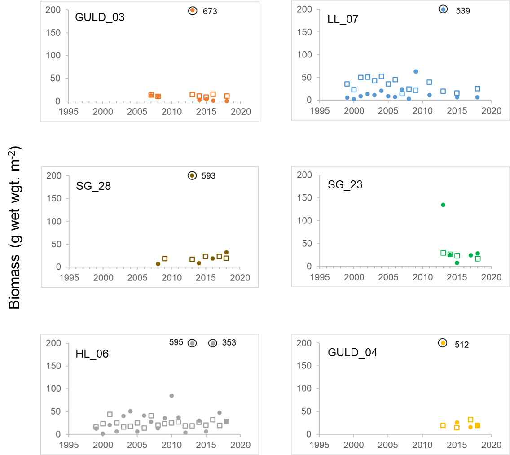

```

\clearpage


(ref:fig31-caption) Average spring abundances of the ten most abundant copepod taxa at stations at the shelf-break upstream (LL_07) and downstream (HL_06) of the Gully, and at one station within the Gully (GULD_03) and averaged over three stations across the Gully mouth (SG_28, GULD_04, and SG_23). The numbers (N) in the legend represent the sums of the ten most abundant taxa at each location with units of 1000s m\textsuperscript{-2}.

```{r figure31, fig.align = "center", fig.cap = "(ref:fig31-caption)", out.width = "5.5in"}

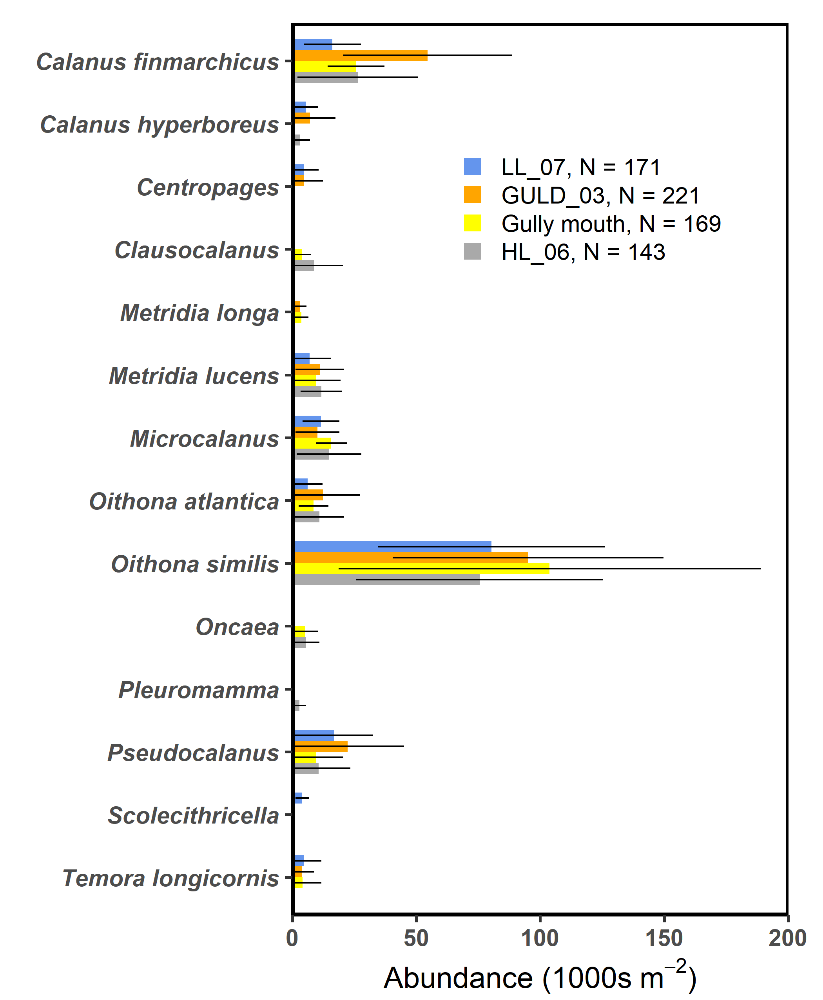

```

\clearpage


(ref:fig32-caption) Average fall abundances of the ten most abundant copepod taxa at stations at the shelf-break upstream (LL_07) and downstream (HL_06) of the Gully, and at one station within the Gully (GULD_03) and averaged over three stations across the Gully mouth (SG_28, GULD_04, and SG_23). The numbers (N) in the legend represent the sums of the ten most abundant taxa at each location with units of 1000s m\textsuperscript{-2}.

```{r figure32, fig.align = "center", fig.cap = "(ref:fig32-caption)", out.width = "5.5in"}

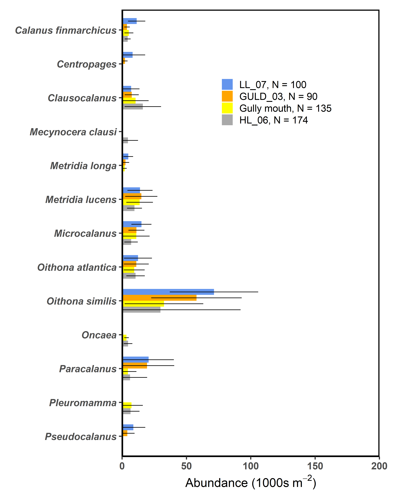

```

\clearpage


<!-- Begin Landscape here  -->

(ref:fig33-caption) Relationships between the Population Development Index (Abundance CI-III/Abundance CI-VI, %) for _Calanus finmarchicus_ populations versus sampling date minus spring bloom initiation date (top row), and April sea surface temperature (bottom row), for HL_06, SW HL and LL_07, SW LL. 

\begin{landscapepage}

```{r figure33, fig.align = "center", fig.cap = "(ref:fig33-caption)", out.width = "7.5in"}

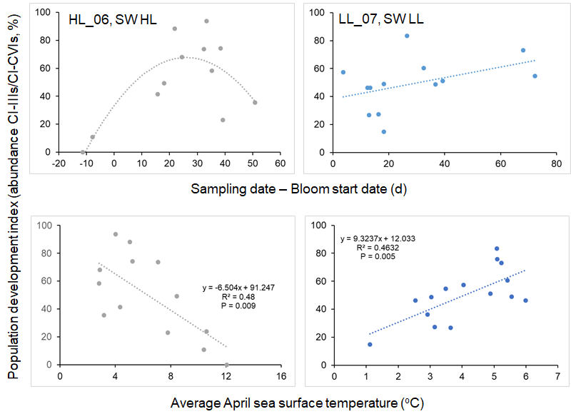

```

\end{landscapepage}
\clearpage

<!-- End Landscape here  -->


(ref:fig34-caption) Abundance of stage CV (filled circles) and stage CIV (open squares) _Calanus finmarchicus_ versus sampling date at LL_07, GULD_03 and HL_06 in fall between 1999 and 2018. Note that the outlier circled in black from 2017 at LL_07 was excluded from the only significant correlation between abundance and sampling date.

```{r figure34, fig.align = "center", fig.cap = "(ref:fig34-caption)", out.width = "4.75in"}

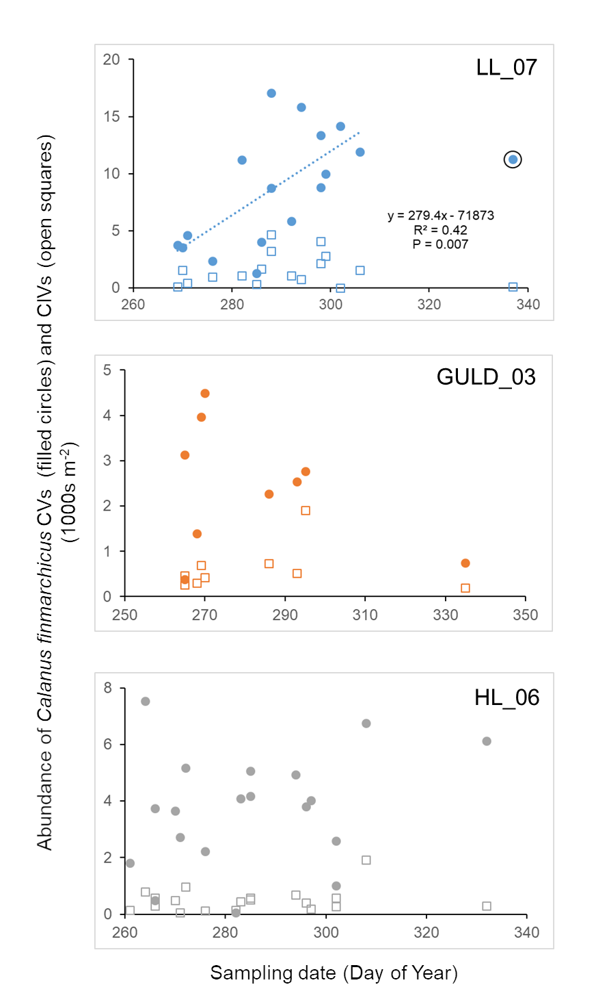

```

\clearpage
